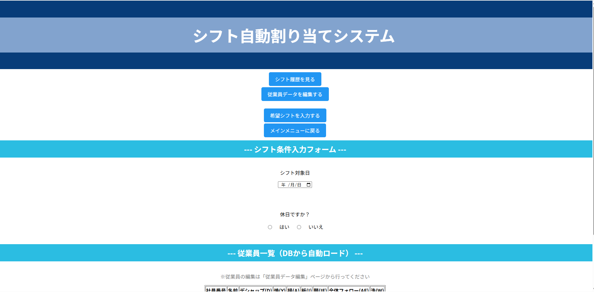
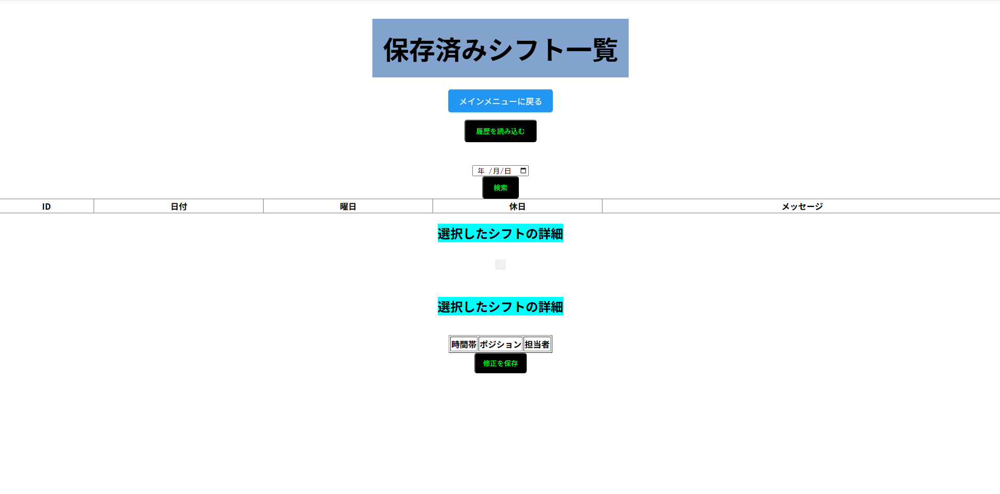
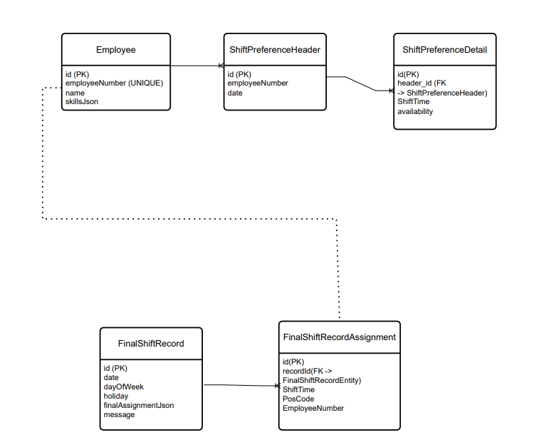

# Restaurant Shift Scheduling Web Application

Java / Spring Boot / PostgreSQL / REST API / JPA / Web Application

---

## 本プロジェクトの特徴

- 飲食店の実業務を元にした課題解決型アプリ
- シフト作成の人員選定を自動化
- AWS EC2上にデプロイ済み（外部公開）
- Strategyパターンによる柔軟なロジック設計

---

## 1. 概要（Overview）

本アプリケーションは、私が学生時代にアルバイトをしていた飲食店をモデルとして開発した  
**シフト自動生成Webアプリケーション**です。

シフト作成における人的負担や作業時間の削減を目的とし、  
従業員の **スキル・希望シフト・日ごとの必要人数** を考慮した  
自動シフト生成ロジックを実装しています。

生成結果はデータベースに保存され、

- 履歴の参照
- 内容の確認
- 時間帯・ポジション単位での手動修正

を行うことができます。

シフト作成者が最終確認と微調整に集中できるよう、
シフト作成業務の効率化を目的として設計しました。

---

## 2. 動作紹介動画（Demo）

アプリケーションの基本的な操作は  
以下の動画で確認できます。

▶ **デモ動画（約1分40秒）**  
https://youtu.be/LU-z3zEHb18

動画では以下の流れを紹介しています。

1. 従業員データの読み込み  
2. 希望シフトの入力  
3. シフト自動生成  
4. 生成結果の表示  
5. 手動修正  
6. シフト履歴の保存  

---

## 3. 主な機能（Features）

- 従業員情報の管理
- 希望シフトの入力・管理
- シフトの自動生成
- 生成結果の保存（履歴管理）
- 保存済みシフトの一覧表示
- 日付による検索
- シフトの手動修正（時間帯 × ポジション）
- 重複割り当ての検出・警告表示

---

## 4. スクリーンショット（Screenshots）

### メインメニュー


### シフト自動生成画面



### シフト履歴画面



※ UI は現在改善途中です。

---

## 5. 使用技術（Tech Stack）

### バックエンド
- Java
- Spring Boot
- Spring Data JPA
- Hibernate
- Jackson

### フロントエンド
- HTML
- JavaScript（Vanilla JS）

### データベース
- PostgreSQL（本番想定）
- H2（開発用）

---

## 6. システム構成・アーキテクチャ

本システムは以下の構成で実装しています。

```
Browser (HTML / JavaScript)
        ↓
Spring Boot REST API
        ↓
Service Layer
        ↓
Repository Layer (JPA)
        ↓
PostgreSQL Database
```

Controller / Service / Repository の  
**レイヤードアーキテクチャ**を採用しています。

---

## 7. ディレクトリ構成

本プロジェクトは Maven / Spring Boot の標準構成に従っています。

```
src
 └ main
    ├ java
    │   └ position
    │       ├ controller
    │       ├ dto
    │       ├ entity
    │       ├ factory
    │       ├ mapper
    │       ├ model
    │       ├ repository
    │       ├ service
    │       ├ strategy
    │       ├ util
    │       └ PositionApplication.java
    │
    └ resources
        ├ static
        │   ├ css
        │   ├ js
        │   └ html
        └ application.properties
```

スタッフ選定ロジックおよびポジション割り当てロジックは  
`strategy` パッケージに分離し、Strategy パターンにより拡張しやすい構成としています。

---

## 8. データベース設計（ER）

本システムで使用している主要エンティティは以下の通りです。

- Employee
- ShiftPreferenceHeader
- ShiftPreferenceDetail
- FinalShiftRecord
- FinalShiftRecordAssignment

### ER図

主要エンティティ間の関係を以下に示します。



### 設計上の工夫

希望シフトは **正規化** し、更新・整合性を重視しています。

一方で確定シフトは、

- JSON保存（履歴再現・表示用）
- 明細テーブル（検索・編集用）

の **ハイブリッド構成**を採用し、  
用途に応じて最適なデータ構造を使い分けています。

---

## 9. クラス設計

本アプリケーションでは、シフト生成処理を

- 出勤者選定
- ポジション割り当て

の2段階に分離しています。

出勤者選定では `StaffSelectStrategy` を用いて候補者の選定基準を切り替え可能にし、  
ポジション割り当てでは `AssignmentStrategy` と `AssignmentStrategyFactory` により  
平日・休日で異なる割り当てロジックを適用しています。

### クラス図

```mermaid
classDiagram

class ShiftAssignController {
  +assignShift(request) ShiftResponse
}

class AutoShift {
  - staffSelectStrategy : StaffSelectStrategy
  +selectWorkingStaffByTime(ableStaff, conditions, shiftPreferences) Map~ShiftTime, List~Employee~~
}

class PosAssign {
  - strategyFactory : AssignmentStrategyFactory
  +execute(staffByTime, conditions) Map~ShiftTime, Map~Pos, List~Employee~~
}

class StaffSelectStrategy {
  <<interface>>
  +selectStaff(ableStaff, conditions, shiftPreferences, targetTime) List~Employee~
}

class EfficiencySelectStrategy {
  +selectStaff(ableStaff, conditions, shiftPreferences, targetTime) List~Employee~
}

class AssignmentStrategy {
  <<interface>>
  +assign(staff, conditions, time) Map~Pos, List~Employee~~
}

class AbstractAssignmentStrategy {
  #assignFixedPositionStaff(staff, requiredCount, assignedStaff)
  #getSortedPosByWeight()
  #calcOverallSkill(staff)
}

class WeekdayAssignmentStrategy {
  +assign(staff, conditions, time)
}

class HolidayAssignmentStrategy {
  +assign(staff, conditions, time)
}

class AssignmentStrategyFactory {
  +get(isHoliday) AssignmentStrategy
}

class ShiftRequest {
  +toEmployeeList() List~Employee~
  +toPreferenceList(employees) List~ShiftPreference~
  +getDayOfWeek() DayOfWeek
  +getIsHolidayFlag() boolean
}

class ShiftResponse

class Schedule
class Employee
class ShiftPreference
class ShiftTime
class Pos
class DayOfWeek
class FinalShiftRecord

ShiftAssignController --> ShiftRequest : receives
ShiftAssignController --> ShiftResponse : returns
ShiftAssignController --> AutoShift : uses
ShiftAssignController --> PosAssign : uses
ShiftAssignController --> Schedule : creates

AutoShift --> StaffSelectStrategy : uses
AutoShift --> Employee : selects
AutoShift --> ShiftPreference : refers
AutoShift --> ShiftTime : groups by
AutoShift --> Schedule : refers

EfficiencySelectStrategy ..|> StaffSelectStrategy
EfficiencySelectStrategy --> Employee : evaluates
EfficiencySelectStrategy --> ShiftPreference : filters

PosAssign --> AssignmentStrategyFactory : uses
PosAssign --> AssignmentStrategy : uses
PosAssign --> Employee : assigns
PosAssign --> Schedule : refers
PosAssign --> ShiftTime : iterates by
PosAssign --> Pos : assigns to

AbstractAssignmentStrategy ..|> AssignmentStrategy
WeekdayAssignmentStrategy --|> AbstractAssignmentStrategy
HolidayAssignmentStrategy --|> AbstractAssignmentStrategy

AssignmentStrategyFactory --> WeekdayAssignmentStrategy : creates
AssignmentStrategyFactory --> HolidayAssignmentStrategy : creates

ShiftRequest --> Employee : converts to
ShiftRequest --> ShiftPreference : converts to
ShiftRequest --> DayOfWeek : converts to

ShiftResponse --> Employee : contains
ShiftResponse --> ShiftTime : contains
ShiftResponse --> Pos : contains

FinalShiftRecord --> Employee
FinalShiftRecord --> ShiftTime
FinalShiftRecord --> Pos
```



### 設計上のポイント

- `AutoShift` は時間帯ごとの出勤者選定を担当
- `PosAssign` は選定された従業員を時間帯・ポジションごとに割り当てる処理を担当
- `AssignmentStrategy` により、平日・休日で異なる割り当て方針を切り替え
- `StaffSelectStrategy` により、出勤者選定基準を分離
- `ShiftAssignController` はリクエストを受け取り、出勤者選定とポジション割り当てを組み合わせて最終的なシフト結果を生成する
- Strategy パターンの採用により、選定ロジックの追加や変更を既存コードへの影響を抑えて行えるようにした
---

## 10. シフト自動生成アルゴリズム

考慮する要素

- 従業員の希望
- スキル
- 時間帯ごとの必要人数
- ポジションの重要度

実際の現場では

- 体調
- 人間関係
- 突発的事情

など数値化できない要素が存在します。

そのため本アプリでは  
**厳密な最適化問題として定式化することは行わず**

制約を満たすことを優先し、計算量と実行速度を考慮した上で、実務での利用を想定して高速に結果を出せる

**ポジション重要度順の貪欲法（ヒューリスティック）**

を採用しています。

スキル値をもとに従業員を評価し、ポジションの重要度順に優先度の高いポジションから順に割り当てることで、制約を満たしつつ全体の効率を最大化するよう設計しました。

---

## 11. 実装上の工夫

### Entity / DTO 分離

- Entity を直接 API レスポンスに使用しない
- 循環参照による JSON 無限生成の防止
- フロントに不要なデータを送らない

### 確定シフト保存設計

確定シフトは

```
finalAssignmentJson
```

に JSON 形式で保存。

同時に

```
FinalShiftRecordAssignment
```

テーブルに分解して保存することで

- 編集
- 検索

を可能にしています。

---

## 12. 発生した主なエラーと解決

### JSONパースエラー

原因  
JSON構造不整合

対応  
フロント / バックエンドの形式統一

### Hibernate TransientPropertyValueException

原因  
親Entity未保存状態で子Entity保存

対応  

```
Record → Assignment
```

の順で保存

---

## 13. ビルド構成問題の解決

開発途中で Maven 構成変更により  
IDE上で大量エラーが発生しました。

原因

```xml
<sourceDirectory>src</sourceDirectory>
```

設定により  
Maven が `src` をソースフォルダと誤認識していました。

対応

- 設定削除
- `src/main/java` に統一
- Maven Update

---

## 14. AI（ChatGPT）の活用

### 活用内容

- エラーログ解析
- 設計レビュー
- JSONデータ解析
- 修正方針検討

### 方針

- 丸投げしない
- ログを渡して原因分析
- 提案を比較検討
- 理解したもののみ実装

---

## 15. 起動方法（Getting Started）

### 必要環境

- Java 21
- Maven
- PostgreSQL

### 1. リポジトリ取得

```
git clone https://github.com/yourname/position.git
cd position
```

### 2. 設定ファイル作成

```
src/main/resources/application.properties
```

を作成

```
spring.datasource.url=jdbc:postgresql://localhost:5432/shiftdb
spring.datasource.username=your_user
spring.datasource.password=your_password
spring.jpa.hibernate.ddl-auto=update
```

※ `application.properties.example` を参考

### 3. アプリ起動

```
mvn spring-boot:run
```

または

```
java -jar target/position-0.0.1-SNAPSHOT.jar
```

### 4. アクセス

```
http://localhost:8080
```

---

## 16. 成果

本アプリケーションにより、

- 作成者の作業を「ゼロから作る」→「確認・修正のみ」に削減
- 主観的には約50%程度の負担軽減を想定
- 人的ミス（重複割り当て等）の防止

を実現できる仕組みを構築しました。

---

## 17. インフラ構築（AWS） 

### デプロイ環境
- AWS EC2 (Amazon Linux)
- Spring Boot (Java)
- PostgreSQL

### 構成
- フロント：HTML / JavaScript
- バックエンド：Spring Boot
- DB：PostgreSQL（EC2内）

### 工夫した点
- REST API設計
- DTOによるデータ分離
- Strategyパターンによるロジック切替
- AWSへのデプロイ（環境構築〜公開まで）

### 課題と解決
- PostgreSQL接続時に認証エラー（ident認証）が発生  
  → pg_hba.conf を修正し、パスワード認証（md5）へ変更することで解決
- フロントエンドが localhost にリクエストを送信してしまう問題が発生  
  → APIエンドポイントを相対パスに修正し、環境依存しない構成へ改善

### 公開URL
http://15.134.231.70:8080/
※EC2の再起動によりIPアドレスが変更される場合があります

### AWSへのデプロイで経験した事
- EC2上にSpring Bootアプリをデプロイし、外部からアクセス可能な状態を構築
- PostgreSQLをEC2内に構築し、アプリケーションとの接続設定を実施
- SSH接続・Linux操作・ポート開放などインフラ設定を一通り経験
  
将来的には、アプリケーションサーバーとデータベースを分離し、EC2 + RDS 構成へ拡張する予定です。

---

## 18. 技術選定理由 

- Spring Boot : DIやレイヤード構成を通じて、実務に近いアーキテクチャ設計を学ぶため 
- PostgreSQL : トランザクションや正規化など、RDB設計の理解を深めるため
- JPA : オブジェクト指向とリレーショナルモデルのマッピングを理解するため
- Vanilla JS : 基礎理解重視 

---


## 19. 今後の改善予定

- UI / UX 改善
- シフト生成アルゴリズム高度化
- 複数店舗対応
- 権限管理

---

## 20. 学び

- フロント・バック・DB間のデータ整合性が崩れるとシステム全体に影響することを実感
- エラーログをもとに原因を切り分けることで、再現性のある問題解決が重要であると学んだ
- AIとの協働開発：エラーログ解析や設計検討の補助として活用し、設計に基づいたサンプルコードの生成にも利用した。生成結果をそのまま採用するのではなく、内容を検証・修正した上で自身の設計に適合させて実装した。

単なる動作アプリではなく  
**保守性・拡張性を考慮した設計経験**を得ました。

---

## 21. Author

明治大学 理工学部 情報科学科  山下裕貴
制作期間：2025年9月〜2026年3月
